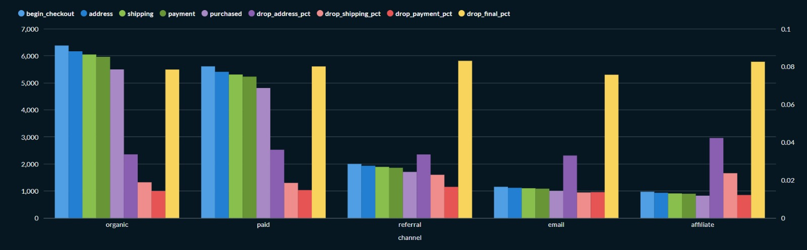
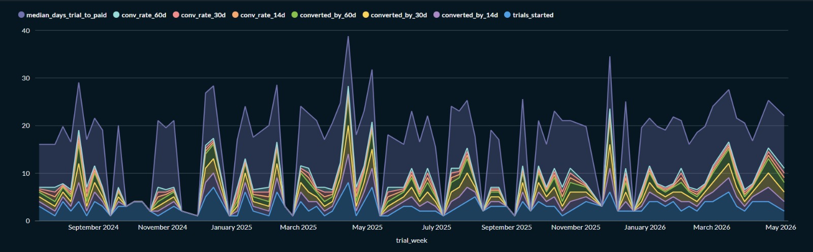
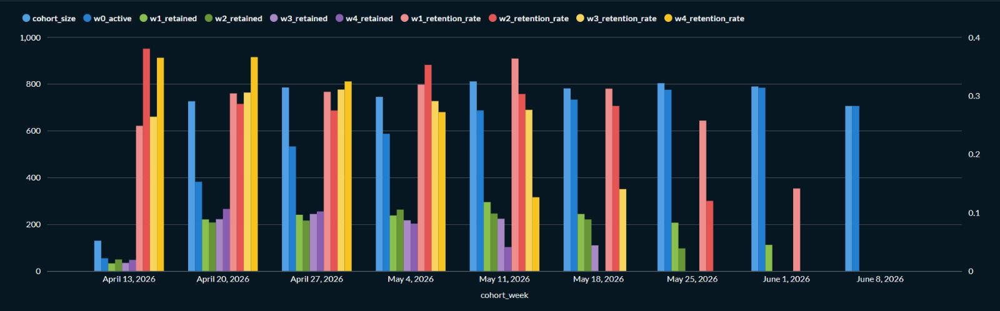
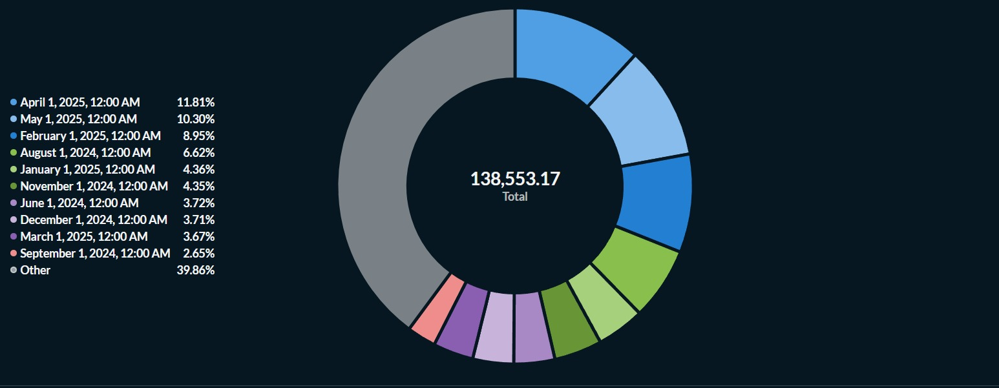
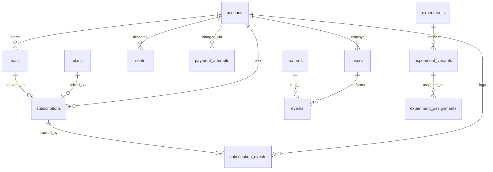

# SQL Product Analytics — Task 2

10 product-analytics queries — 5 on a B2C ecommerce dataset (`ecom` schema),
5 on a SaaS dataset that serves both a self-serve (B2C-motion) segment and
a B2B segment inside one product (`saas` schema). Where Task 1 asked
*"is the business healthy?"*, this task asks *"how are users behaving, and
what is that behavior worth?"*

Full write-up with 5 cross-domain insights: **[B2C vs B2B: How Funnels and
Retention Actually Differ](https://sharp-postage-351.notion.site/What-10-SQL-Queries-Told-Me-About-This-Business-39ddb0c6f8c280fc8010cc98517001c3?source=copy_link)**

Connect with me: [www.linkedin.com/in/raj-dev-63963a22b](https://www.linkedin.com/in/raj-dev-63963a22b)

## Headline Findings

- **Activation collapsed from 16.3% to 4.3%** across fully-observed weekly
  signup cohorts (E1) — not a censoring artifact, a real trend.
- **Churn MRR spiked 3-10x** in Jan-March 2026 (up to ₹13,821/month vs. a
  typical ₹1,000-4,000/month) — and the May/June 2025 cohorts' GRR collapsed
  to ~32% exactly 12 months later, two independent queries pointing at the
  same event (S1, S3).
- **NRR exceeded 100% in multiple cohorts, peaking at 127%** — the SaaS
  "holy grail" metric, meaning retained customers expanded enough to grow
  cohort revenue even after subtracting churn (S3).
- **Checkout leaks the same 7.6%-8.3% at the payment-to-purchase step
  across every acquisition channel** — a shared product problem, not a
  channel-quality problem (E2).

## B2C vs B2B — What Actually Differs

| Dimension | B2C (ecom) | B2B / Self-Serve (SaaS) |
|---|---|---|
| **Grain of analysis** | Session | Account (self-serve = user-grain, b2b = account-grain) |
| **Time horizon** | Minutes (browse → checkout in one session) | Weeks to months (trial → paid → expansion) |
| **"Funnel"** | Product view → cart → checkout → purchase | Signup → trial → paid → expansion |
| **"Retention"** | Behavioral — did the same user come back and do something | Commercial — did the same account keep paying, and pay more (GRR/NRR) |
| **"Activation"** | Did a signup take a meaningful action within 7 days | Did a trial convert to paid within 14 days |
| **Ceiling metric** | Repeat purchase rate > 100% is meaningless | Net Revenue Retention > 100% is the SaaS "holy grail" |
| **Self-selection trap** | High-intent shoppers self-select into search | Engaged accounts self-select into feature adoption |
| **Dominant lever found this week** | Payment-completion friction (consistent 7-8% drop at final checkout step across all channels) | Seat-expansion revenue per account outweighs plan-upgrade revenue, despite touching fewer accounts |

## Query Index — Jump to What Interests You

| File | Business Question | Stakeholder |
|---|---|---|
| `e1_activation_curve.sql` | How fast do signups become real users? | Growth / Product |
| `e2_checkout_funnel.sql` | Where does checkout leak, by channel? | Growth Marketing |
| `e3_cohort_retention.sql` | Do users come back and engage weekly? | Product |
| `e4_pdp_engagement.sql` | Which products get viewed but not carted? | Merchandising |
| `e5_cart_abandonment.sql` | Where is abandoned GMV concentrated? | Growth / Checkout |
| `s1_mrr_movements.sql` | How did MRR change, and why? | CFO / Board |
| `s2_trial_to_paid.sql` | How fast do trials convert to paid? | Sales / Growth |
| `s3_grr_nrr.sql` | Are we keeping and growing cohort revenue? | CFO / Board |
| `s4_feature_adoption.sql` | Which features predict retention? | Product |
| `s5_expansion_revenue.sql` | What's driving expansion revenue? | Customer Success |

## Key Visuals

**E2 — Checkout Funnel Drop-off by Channel**


**S2 — Trial-to-Paid Conversion by Cohort**


**E3 — Weekly Cohort Retention**


**S3 — GRR / NRR by Cohort**


## Database Schema



*(Full ecom schema diagram is in the [Task 1 repo](https://github.com/rajtechnosgs/sql-business-insights); this diagram covers the new `saas` schema introduced this week.)*

## Repo Structure

```
queries/
├── e1_activation_curve.sql
├── e2_checkout_funnel.sql
├── e3_cohort_retention.sql
├── e4_pdp_engagement.sql
├── e5_cart_abandonment.sql
├── s1_mrr_movements.sql
├── s2_trial_to_paid.sql
├── s3_grr_nrr.sql
├── s4_feature_adoption.sql
└── s5_expansion_revenue.sql
notes/saas_schema.md   — SaaS schema recon: tables, relationships, data-quality findings
screenshots/           — Metabase visualizations for key queries
```

## How to Run

All 10 queries run against the internal Metabase server used for this
program — `ecom` queries (e1-e5) against the `ecom` schema, `saas` queries
(s1-s5) against the `saas` schema. Open Metabase, select the relevant
database, and paste the contents of any file from `queries/` into the SQL
editor.

## Reflection

This week's biggest lesson was that the same SQL toolkit (CTEs, window
functions, sanity checks) produces very different *kinds* of answers
depending on the domain — B2C queries lean behavioral, B2B queries lean
commercial. Several real data-quality surprises turned into some of the
most useful findings: session activity in `ecom` wasn't strictly anchored
after signup, and S1's MRR reconciliation never fully tied out despite
checking multiple causes — both documented as known limitations rather
than forced to a clean number. A subscriptions-join fan-out bug in S4
(caught in review) was a good reminder that every join needs an explicit
answer to "is this still one row per entity after this join" — not just
at the start of a query, but after every join added later.
