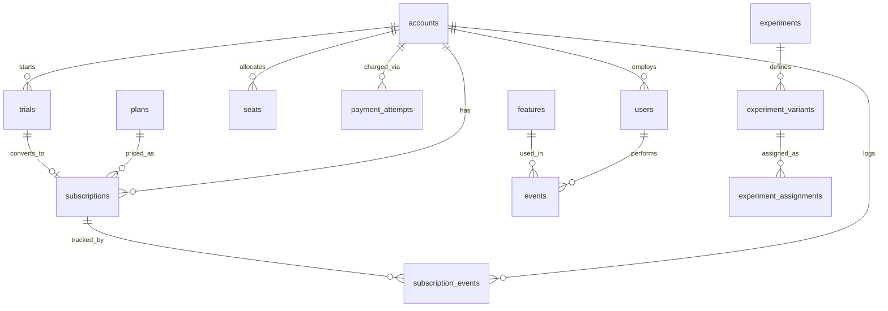

# SQL Product Analytics — Task 2

10 product-analytics queries — 5 on a B2C ecommerce dataset (`ecom` schema),
5 on a SaaS dataset that serves both a self-serve (B2C-motion) segment and
a B2B segment inside one product (`saas` schema). Where Task 1 asked
*"is the business healthy?"*, this task asks *"how are users behaving, and
what is that behavior worth?"*

Full write-up with 5 cross-domain insights: **[B2C vs B2B: How Funnels and
Retention Actually Differ](https://sharp-postage-351.notion.site/B2C-vs-B2B-How-Funnels-and-Retention-Actually-Differ-3a5db0c6f8c280488c9cd5fb8da59478?source=copy_link)

Connect with me: [www.linkedin.com/in/raj-dev-63963a22b](https://www.linkedin.com/in/raj-dev-63963a22b)

## B2C vs B2B — What Actually Differs

| Dimension | B2C (ecom) | B2B / Self-Serve (SaaS) |
|---|---|---|
| **Grain of analysis** | Session | Account (self-serve = user-grain, b2b = account-grain) |
| **Time horizon** | Minutes (browse → checkout in one session) | Weeks to months (trial → paid → expansion) |
| **"Funnel"** | Product view → cart → checkout → purchase | Signup → trial → paid → expansion |
| **"Retention"** | Behavioral — did the same user come back and do something | Commercial — did the same account keep paying, and pay more (GRR/NRR) |
| **"Activation"** | Did a signup take a meaningful action within 7 days | Did a trial convert to paid within 14 days |
| **Ceiling metric** | Repeat purchase rate > 100% is meaningless | Net Revenue Retention > 100% is the SaaS "holy grail" |
| **Self-selection trap** | High-intent shoppers self-select into search | Engaged accounts self-select into feature adoption |
| **Dominant lever found this week** | Payment-completion friction (consistent 7-8% drop at final checkout step across all channels) | Seat-expansion revenue per account outweighs plan-upgrade revenue, despite touching fewer accounts |

## Database Schema



*(Full ecom schema diagram is in the [Task 1 repo](https://github.com/rajtechnosgs/sql-business-insights); this diagram covers the new `saas` schema introduced this week.)*

## Repo Structure

```
queries/              — 10 numbered .sql files (e1-e5 = ecom, s1-s5 = saas)
notes/saas_schema.md  — SaaS schema recon: tables, relationships, data-quality findings
```

Each `.sql` file carries a 4-part header: business question, what the result
tells us, a concrete PM action, and the sanity check run to verify it.

## How to Run

All 10 queries run against the internal Metabase server used for this
program — `ecom` queries (e1-e5) against the `ecom` schema, `saas` queries
(s1-s5) against the `saas` schema. Open Metabase, select the relevant
database, and paste the contents of any file from `queries/` into the SQL
editor.

## Reflection

This week's biggest lesson was that the same SQL toolkit (CTEs, window
functions, sanity checks) produces very different *kinds* of answers
depending on the domain — B2C queries lean behavioral, B2B queries lean
commercial. Several real data-quality surprises turned into some of the
most useful findings: session activity in `ecom` wasn't strictly anchored
after signup (some browsing happens before account creation), and S1's
MRR reconciliation never fully tied out despite checking multiple causes
— both are documented as known limitations rather than forced to a clean
number. If I did this again, I'd write each query's sanity check *before*
writing the main query, since several bugs (E1's negative activation
time, E3's w0_active mismatch) would have surfaced immediately instead of
after the fact.
