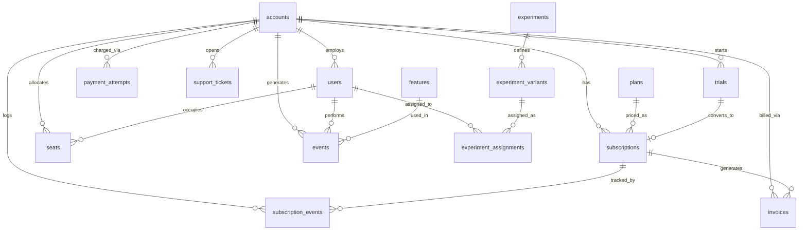

# saas Schema Notes

Personal reference for the `saas` database — same purpose as `ecom_schema.md`
from Week 1. Built Day 1, extended as later queries touch new columns.

---

## Six Probe Questions (Required by Brief)

**1. What is the grain of `subscriptions`?**
Split grain — this is the single most important thing to know before writing
any S-series query.
- **self_serve accounts:** subscriptions are **user-grain** — `user_id` is
  set, `seat_count = 1`. Confirmed: 2,000 rows.
- **b2b accounts:** subscriptions are **account-grain** — `user_id` is NULL,
  `seat_count` ranges into the dozens. Confirmed: 113 rows.
- Every S-series query must branch on this or aggregate on `account_id`
  (the one column common to both grains) rather than `user_id`.

**2. How is MRR stored?**
Two places, two different purposes — do not mix them in one calculation:
- `subscriptions.mrr` — current **snapshot** value (what the account/user
  pays right now).
- `subscription_events.mrr_delta` — signed **movement log** (how MRR changed
  at each event: positive = new/upgrade, negative = downgrade/churn).
- On B2B rows, `mrr = plans.monthly_price × seat_count` exactly. On
  self-serve rows, expect odd decimals — proration artifacts from the old
  billing engine (documented, not a bug).

**3. What status values exist on `subscriptions`, with counts?**
```
active      885
churned     557
trialing    292
past_due    195
paused      184
```
(Total 2,113 — matches full row count, no unexpected values.)

**4. How do you identify a trial vs a paid subscription?**
Separate `trials` table (`trial_id`, `account_id`, `started_at`, `ends_at`,
`converted_at`, `converted_subscription_id`). A trial has converted when
`converted_at IS NOT NULL`; `converted_subscription_id` then points to the
resulting paid `subscriptions` row. `subscriptions.status = 'trialing'` is
the live-trial marker on the subscription itself.

**5. What timezone are timestamp columns in?**
Mixed — this is a real data-quality finding, not an assumption to skip:
- `with time zone`: `accounts.signup_date`, `seats.activated_at`/
  `deactivated_at`, `trials.started_at`/`ends_at`, `support_tickets.opened_at`
  /`closed_at`, `email_sends.sent_at`/`opened_at`/`clicked_at`.
- `without time zone`: `subscriptions.start_date`, `subscription_events.
  event_time`, `events.occurred_at`, `invoices.issued_date`, `payment_
  attempts.attempted_at`, `experiments.start_date`/`end_date`.
- Practical implication: when joining a `with time zone` column to a
  `without time zone` column for cohort math, confirm both are effectively
  UTC before trusting a week/day bucket — a silent offset would smear
  cohort boundaries.

**6. Is there a soft-delete pattern?**
No `deleted_at` (or similar) column found on any table in this schema —
soft-delete does not appear to be used here. No `WHERE deleted_at IS NULL`
filter needed.

---

## A. Table Inventory

| Table | Approx Rows | What it Stores | Grain |
|---|---|---|---|
| accounts | 1,250 | The paying entity — self_serve or b2b | one row per account |
| users | 2,556 | Humans inside an account | one row per user |
| subscriptions | 2,113 | Plan attached to a user (self-serve) or account (b2b) | split grain — see probe Q1 |
| subscription_events | 3,741 | MRR-movement event log — the most important table this week | one row per plan/seat/mrr-changing event |
| plans | (small) | Pricing tiers (free/starter/pro/enterprise × monthly/annual) | one row per plan |
| trials | (small) | Trial start/end/conversion tracking | one row per trial |
| seats | 1,556 | Seat assignments within a b2b account | one row per seat assignment |
| invoices | 4,201 | Billed amount + payment status per period | one row per invoice |
| payment_attempts | 5,690 | Every charge attempt, success or failure, with retry tracking | one row per attempt |
| events | 53,534 | Product telemetry — who did what, when | one row per event |
| features | (small) | Feature catalog | one row per feature |
| support_tickets | 1,249 | Account-level support load | one row per ticket |
| email_sends | 3,385 | Lifecycle/re-engagement/dunning email log | one row per send |
| experiments | (small) | Product experiment definitions | one row per experiment |
| experiment_variants | (small) | Variant definitions per experiment | one row per variant |
| experiment_assignments | 3,200 | User → variant assignment | one row per assignment |
| signups | (view) | (user_id, account_id, signup_date, signup_source) helper view | one row per signup |
| legacy_companies | — | Pre-migration B2B companies — **ignore, reference only** | — |
| legacy_events | 15,028 | Pre-migration events — **ignore, reference only** | — |
| legacy_invoices | 1,500 | Pre-migration invoices — **ignore, reference only** | — |
| legacy_subscriptions | 500 | Pre-migration subscriptions — **ignore, reference only** | — |
| legacy_support_tickets | — | Pre-migration tickets — **ignore, reference only** | — |

---

## B. Per-Column Notes (Top 6 Tables)

### accounts
- `account_id` — primary key
- `account_type` — `self_serve` (1,000) or `b2b` (250). Drives the grain
  split in `subscriptions` and is the key segmentation column for the
  entire B2C-vs-B2B case study this week.
- `industry`, `employee_count`, `country` — b2b firmographic context, likely
  sparse/NULL on self_serve rows
- `signup_date` — `with time zone`
- `acquisition_channel` — marketing source

### users
- `user_id` — primary key
- `account_id` — soft FK to `accounts.account_id`
- `plan_type` — ⚠️ has the same case/name drift as `subscriptions.plan`
  (see Section E) — normalize with `LOWER()` before grouping
- `role` — owner/admin/member (relevant for b2b multi-seat accounts)
- `is_active` — integer flag, not boolean — confirm 0/1 vs other values
  before treating as a clean boolean

### subscriptions
- `subscription_id` — primary key
- `user_id` — **set on self-serve rows, NULL on b2b rows** (grain split)
- `account_id` — the safe column to aggregate on regardless of grain
- `plan` — text, has case/name drift (pro/Pro/professional) — normalize
- `plan_id` — ⚠️ ~9% NULL even where `plan` text is populated — the plan
  still exists as text, needs manual normalization back to a `plans` row
- `seat_count` — 1 on self-serve, multi on b2b
- `mrr` — current snapshot value, see probe Q2
- `status` — 5 values, see probe Q3
- `cancelled_at`, `cancellation_reason` — ⚠️ ~31% NULL on churned rows,
  bucket as "no reason given" rather than dropping

### subscription_events
- `event_id` — primary key
- `subscription_id`, `account_id`, `user_id`, `actor_user_id` — account_id
  is the safe aggregation grain
- `event_type` — legacy vocab (`subscription_started`, `plan_changed`,
  `cancelled`, `trial_started`) + B2B vocab (`trial_converted`, `seat_add`,
  `addon_attach`) — no pre-bucketed MRR-movement label, must derive
  new/expansion/contraction/churn/reactivation manually (this is the core
  work of Query S1)
- `from_plan`, `to_plan` — NULL on `subscription_started` (`from_plan`) and
  on `cancelled` (`to_plan`)
- `mrr_delta` — signed change; positive = new/upgrade, negative =
  downgrade/churn
- `seats_delta` — set on `seat_add` rows only
- ⚠️ **234 future-dated rows** (timestamps after cohort start) — a legacy
  billing-engine artifact. Exclude from any as-of-cohort-start MRR
  reconciliation, in every query that touches this table (S1, S3, S5).

### plans
- `plan_id` — primary key
- `plan_name` — the canonical name (compare against `subscriptions.plan`
  text to build the normalization mapping)
- `monthly_price` — USD
- `seat_limit` — max seats for the tier
- `billing_interval` — monthly/annual

### features + events (adoption analysis pair)
- `features.feature_id` — primary key; `feature_name`, `category`
- `events.feature_id` — FK to `features.feature_id`, but only on newer
  rows. Older legacy-vocab event rows have NULL `feature_id` and carry the
  feature name only as text inside `properties` — a real vocabulary-drift
  finding, not an obstacle (the `feature_id` path covers what Query S4
  needs).
- `events.user_id` — ⚠️ ~40 orphan rows reference a `user_id` that doesn't
  exist in `users`. Decide upfront: drop, or bucket as "unattributed."
- `events.account_id` — present directly on the row (denormalized), useful
  since some `user_id`s are orphaned but `account_id` may still resolve

### payment_attempts (bonus — needed if picking Option S4-alt)
- `attempt_id` — primary key
- `invoice_id`, `subscription_id`, `account_id` — multiple grains available;
  `account_id` is safest for account-level dunning analysis
- `failure_reason` — insufficient_funds / card_declined / expired_card /
  authentication_required / fraud_blocked
- `attempt_number` — 1, 2, 3, 4 — retries against the same invoice

---

## C. Verified Relationships

**Declared FKs (database-enforced):** none found — `information_schema.
table_constraints` returns zero rows for `saas` schema, same pattern as
`ecom` in Week 1. All relationships below are soft (inferred from naming).

| Parent | Child | Join Column |
|---|---|---|
| accounts | users | account_id |
| accounts | subscriptions | account_id |
| accounts | subscription_events | account_id |
| accounts | trials | account_id |
| accounts | seats | account_id |
| accounts | invoices | account_id |
| accounts | payment_attempts | account_id |
| accounts | support_tickets | account_id |
| accounts | events | account_id |
| subscriptions | subscription_events | subscription_id |
| subscriptions | invoices | subscription_id |
| subscriptions | payment_attempts | subscription_id |
| plans | subscriptions | plan_id (⚠️ ~9% NULL, see Section E) |
| users | seats | user_id |
| users | events | user_id (⚠️ ~40 orphans, see Section E) |
| users | experiment_assignments | user_id |
| features | events | feature_id (only on newer rows) |
| experiments | experiment_variants | experiment_id |
| experiment_variants | experiment_assignments | variant_id |
| trials | subscriptions | converted_subscription_id |

**Note:** Every account-level table above joins cleanly on `account_id` —
this is the safe universal join key across the whole schema regardless of
the `subscriptions` grain split.

---

## D. ER Diagram



---

## E. Data Quality Findings

1. **Plan name case/naming drift** — `subscriptions.plan` and `users.
   plan_type` mix `pro` (348) / `Pro` (282) / `professional` (294) as three
   separate values for what should be one plan tier, and `enterprise` (287)
   / `Enterprise` (285) as two values for another. Un-normalized, a filter
   like `WHERE plan = 'pro'` silently misses 630 subscriptions
   (`Pro` + `professional` combined). Must `LOWER()` and explicitly collapse
   `pro`/`professional` into one bucket everywhere this column is used.

2. **~9% NULL `plan_id` on `subscriptions`** despite `plan` text being
   populated — the plan identity still exists as a string, so these rows
   need to be normalized back to a `plans.plan_id` via the text match
   (post-`LOWER()`/collapse) rather than dropped.

3. **234 future-dated rows in `subscription_events`** — timestamps after
   the cohort-start cutoff, a legacy billing-engine artifact. Must be
   excluded consistently in every query touching this table (S1, S3, S5) or
   MRR reconciliation will never tie out between queries.

4. **~31% NULL `cancellation_reason` on churned subscriptions** — realistic
   (most churners don't explain why), not a data error. Bucketed as "no
   reason given" rather than dropped, so churn counts aren't understated.

5. **~40 orphan `user_id` rows in `events`** reference users that don't
   exist in `users`. Cannot be attributed to an account via the user path;
   `account_id` on the same row may still resolve independently. Decision:
   surface as "unattributed" rather than silently drop, so adoption/
   activation denominators stay honest.

6. **Mixed timestamp timezone-awareness across the schema** (see probe Q5)
   — `with time zone` and `without time zone` columns coexist. Any cohort
   math that mixes both without checking could smear week/day boundaries.

7. **Subscription and account counts don't reconcile 1:1** — 1,250
   accounts vs 2,113 subscriptions (2,000 self-serve + 113 b2b), meaning
   some accounts have multiple subscription rows over time (churn →
   resubscribe) and/or some accounts have zero subscriptions (trial-only,
   never converted). Worth an orphan check before assuming one subscription
   per account.

---

## F. Three Sample Queries (Proving the Relationships Work)

**1. How many active paying accounts are there right now?**
```sql
select count(distinct account_id) as active_paying_accounts
from saas.subscriptions
where lower(status) = 'active';
```

**2. What's the breakdown of accounts by plan (case-drift collapsed)?**
```sql
select
    case
        when lower(plan) in ('pro', 'professional') then 'pro'
        when lower(plan) = 'enterprise' then 'enterprise'
        else lower(plan)
    end as plan_normalized
  , count(*) as subscriptions
from saas.subscriptions
group by 1
order by subscriptions desc;
```

**3. Show 10 sample subscription_events in chronological order.**
```sql
select
    event_id
  , account_id
  , event_type
  , from_plan
  , to_plan
  , mrr_delta
  , event_time
from saas.subscription_events
order by event_time asc
limit 10;
```
